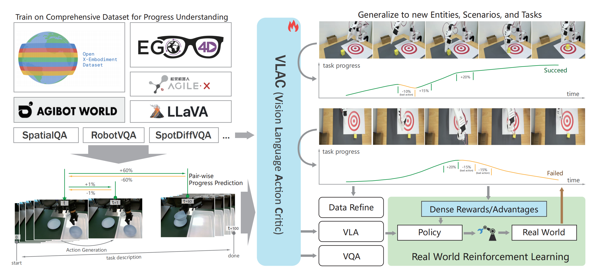

# VLAC: A Vision-Language-Action-Critic Model for Robotic Real-World Reinforcement Learning
<div align="center">

[[paper]](https://arxiv.org/abs/2509.15937)
[[code]](https://github.com/InternRobotics/VLAC)
[[model-2b]](https://huggingface.co/InternRobotics/VLAC)
[[model-8b]](https://huggingface.co/InternRobotics/VLAC-8b)


</div>

## 🚀 Interactive Demo & Homepage

<div align="center">

### [🎮 **Try Interactive & Homepage**](https://vlac.intern-ai.org.cn/)
> **Online Demo is available now in Homepage, Try as you like!!!**

</div>

<div align="center">
  </img>
</div>


## VLAC

VLAC is a general-purpose pair-wise critic and manipulation model which designed for real world robot reinforcement learning and data refinement. 

It provides robust evaluation capabilities for task progress prediction and task completion verification base one images and task description.

VLAC trained on 3000h+ human egocentric data, 1200h+ comprehensive public robotic manipulation data, and 15h+ self-collected manipulation data.

## Service API Note

For the FastAPI service implementation in this repository (`main.py`):

- The critic API is `POST /critic`.
- You must send `image` (current frame) and `reference_image` (reference frame) together in the same request body.
- There is no standalone endpoint to upload or cache reference images.

Minimal request body:

```json
{
  "image": "<base64_or_url_or_path>",
  "reference_image": "<base64_or_url_or_path>",
  "task_description": "..."
}
```

### VLAC-8 is avaliable now [[model-8b]](https://huggingface.co/InternRobotics/VLAC-8b)

## ✨ Key Features

• **Pair-wise comparison mechanism** for improved progressing dense critic accuracy, better recognition of state changes, and each step can be the start of the trajectory.

• **Multi-modal capabilities** - Supports process tracking, task completion judgment, task description estimation, visual question answering, and even embodied action output, equipped with VLA capabilities.

• **Flexible zero-shot and one-shot** - in-context capabilities, maintaining excellent performance across entities, scenarios, and tasks.

• **Human-task synesthesia** - Based on the ego4D human dataset, model understands common tasks and build synesthesia for real-world human tasks and embodied tasks.

• **Trajectory quality screening** - VLAC can evaluate the collected trajectories and filters out low score trajectories based on the VOC value and mask the action with negative pair-wise score, that is, data with low fluency and quality, improving the effect and efficiency of imitation learning.

## Framework

<div align="center">
  
</div>

*The VLAC model is trained on a combination of comprehensive public robotic manipulation datasets, human demonstration data, self-collected manipulation data, and various image understanding datasets. Video data is processed into pair-wise samples to learn the different task progress between any two frames, supplemented with task descriptions and task completion evaluation to enable task progress understanding and action generation, as illustrated in the bottom-left corner. As shown in the diagram on the right, the model demonstrates strong generalization capabilities to new robots, scenarios, and tasks not covered in the training dataset. It can predict task progress and distinguish failure action or trajectory, providing dense reward feedback for real-world reinforcement learning and offering guidance for data refinement. Additionally, the model can directly perform manipulation tasks, exhibiting zero-shot capabilities to handle different scenarios.*

## Performance

Details about the model's performance and evaluation metrics can be found in the [Homepage](https://vlac.intern-ai.org.cn/).

## 🛠️ Installation

To install from source:
```shell
git clone https://github.com/InternRobotics/VLAC.git
cd VLAC
pip install -e .
```
Running Environment:

|              | Range        | Recommended | Notes                                     |
| ------------ |--------------| ----------- | ----------------------------------------- |
| python       | >=3.9        | 3.10        |                                           |
| cuda         |              | cuda12      | No need to install if using CPU, NPU, MPS |
| torch        | >=2.0        |             |                                           |
| transformers | >=4.51       | 4.51.3      |                                           |
| peft | >=0.15.2       |      |                                           |
| ms-swift |        | 3.3      |                                           |


## 🚀 Quick Start

```python
from evo_vlac import GAC_model
from evo_vlac.utils.video_tool import compress_video
import os
#Consistent with the web interface, the value and citic rewards of video input can be evaluated.


#assign local model path
model_path="set to your local model path"
#download model form https://huggingface.co/InternRobotics/VLAC

#assign video path and task description
test_video='evo_vlac/examples/videos/pick-bowl-test.mp4'
ref_video='evo_vlac/examples/videos/pick-bowl-ref.mov'
task_description='Put up the bowl and place it back in the white storage box.'

#init model
Critic=GAC_model(tag='critic')
Critic.init_model(model_path=model_path,model_type='internvl2',device_map=f'cuda:0')
Critic.temperature=0.5
Critic.top_k=1
Critic.set_config()
Critic.set_system_prompt()

# transform video
test_video_compressed = os.path.join(os.path.dirname(test_video),"test.mp4")
_,output_fps=compress_video(test_video, test_video_compressed,fps=5)
reference_video_compressed = None
if ref_video:
    reference_video_compressed = os.path.join(os.path.dirname(ref_video),"ref.mp4")
    compress_video(ref_video, reference_video_compressed,fps=5)


# generate Critic results
result_path,value_list,critic_list,done_list = Critic.web_trajectory_critic(
    task_description=task_description,
    main_video_path=test_video_compressed,
    reference_video_path=reference_video_compressed,#if None means no reference video, only use task_description to indicate the task
    batch_num=5,#batch number
    ref_num=6,#image number used in reference video
    think=False,# whether to CoT
    skip=5,#pair-wise step
    rich=False,#whether to output decimal value
    reverse_eval=False,#whether to reverse the evaluation(for VROC evaluation)
    output_path="results",
    fps=float(output_fps),
    frame_skip=True,#whether to skip frames(if false, each frame while be evaluated, cost more time)
    done_flag=False,#whether to out put done value
    in_context_done=False,#whether use reference video to generate done value
    done_threshold=0.9,#done threshold
    video_output=True#whether to output video
)


print("=" * 100)
print(">>>>>>>>>Critic results<<<<<<<<<<")
print(" ")

print(f"result path: {result_path}")
print(f"task description: {task_description}")
print("=" * 50)

print("value_list:")
print(value_list)
print("=" * 50)

print("critic_list:")
print(critic_list)
print("=" * 50)

print("done_list:")
print(done_list)
print("=" * 100)
```
If the GPU memory is insufficient, please reduce the number of "batch_num".

More examples  of 

• pair-wise image inputs critic. Please check [this example](evo_vlac/examples/image_pair-wise_critic_example.py)

• vla action generation. Please check [this example](evo_vlac/examples/vla_example.py)

• data refinement. Please check [this example](evo_vlac/examples/data_filtering_example.py)


For training code, please refer to [InternVL2](https://huggingface.co/OpenGVLab/InternVL2-2B#quick-start).

## 🔗 Citation

If you find our work helpful, please cite:

```bibtex
@article{zhai2025vision,
  title={A Vision-Language-Action-Critic Model for Robotic Real-World Reinforcement Learning},
  author={Zhai, Shaopeng and Zhang, Qi and Zhang, Tianyi and Huang, Fuxian and Zhang, Haoran and Zhou, Ming and Zhang, Shengzhe and Liu, Litao and Lin, Sixu and Pang, Jiangmiao},
  journal={arXiv preprint arXiv:2509.15937},
  year={2025}
}
```

## 📄 License

This project is licensed under the MIT License.

## 🙏 Acknowledgments

- [SWIFT](https://github.com/modelscope/ms-swift)
- [InternVL](https://github.com/OpenGVLab/InternVL)


